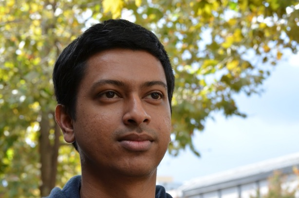

## About Me

Solving complex perception problems in robotics and autonomous driving is my passion. Over the years, I've had the privilege of contributing to groundbreaking work at leading companies like Cruise, Toyota Research Institute, Waymo, and Google Robotics. From hands-on development of SLAM and tracking algorithms to leading teams responsible for critical systems like traffic light detection and multi-object understanding, my journey has focused on leveraging machine learning to make autonomous systems safer and more reliable.

[LinkedIn](https://www.linkedin.com/in/sachih/)

## Work Experience

* Since 2021, I’ve led the Traffic Light and Object Understanding team at Cruise (GM’s self-driving subsidiary), where we develop semantic perception systems for autonomous vehicles. My work spans multi-task models that infer critical attributes—such as gestures and fine-grained classifications—for pedestrians, cyclists, and non-critical objects. I also led a major re-architecture of the traffic light detection system, transitioning to a machine learning-first approach that significantly improved safety and performance. As the perception lead for pedestrian safety, I coordinate cross-functional efforts to enhance how AVs detect and respond to pedestrians.
* At Toyota Research Institute (2019-2021), I led the tracking team in developing a high-performance perception stack for Level 4 autonomous driving, enabling deployment in complex environments like California and Japan. I oversaw the integration of detection and machine learning systems, and managed a distributed team to deliver continuous improvements to the tracking system.
* My journey in autonomous driving began in 2016 at Waymo (Google’s self-driving vehicle subsidiary), where I led the development of advanced state estimation and data association algorithms to improve tracking of vehicles, pedestrians, and other objects. This work contributed to the successful launch of the first fully driverless operations in Phoenix.
* In 2015 I joined Google Robotics where I developed perception systems using LiDAR and RGB-D cameras, built navigation and SLAM algorithms, and worked on full system integration for mobile robot platforms.
* In 2014 I interened at Bosch Personal Robotics Group working on indoor mapping, localization and navigation solutions.

## Research Highlights
* Semantic Mapping with Natural Language (2011–2015)
Developed a framework for robots to build rich environmental models by integrating natural language descriptions with sensor data from LiDAR and cameras.
* Inferring Maps and Behaviors from Natural Language (2014–2015)
Created a probabilistic system that enabled robots to interpret and follow natural language commands without prior environmental knowledge.
* DARPA Virtual Robotics Challenge (2013)
Built perception and control algorithms that allowed the ATLAS robot to drive a vehicle in a simulated environment.
* Intelligent Wheelchair Project (2008-2010)
Developed a speech-commandable robotic wheelchair designed to assist individuals with physical disabilities. Created a "Narrated Guided Tour" feature, allowing users to teach the robot about new environments through natural language, enabling it to build both metric and semantic maps for navigation.
* Envoy project (2010-2011)
Developed a long-duration service robot designed to assist in office environments with tasks such as greeting and escorting guests. Contributed to human-robot interaction, person tracking, and autonomous navigation.

## Education

I hold Ph.D. and Master's degrees in Electrical Engineering and Computer Science from MIT. My doctoral research, advised by Professors Seth Teller and Nicholas Roy, focused on the intersection of robotics and AI, specifically on enabling machines to learn semantic environmental maps from natural language. Prior to that I did my undergraduate studies at University of Moratuwa in Sri Lanka.

---

## Publications

[Google Scholar](https://scholar.google.com/citations?user=7gd0hJYAAAAJ&hl=en)

**Journal Articles**
* M. R. Walter¹, S. Hemachandra¹, B. Homberg, S. Tellex, and S. Teller, "A framework for learning semantic maps from grounded natural language descriptions," International Journal of Robotics Research, 2014
* T. Kollar, S. Tellex, M. R. Walter, A. Huang, A. Bachrach, S. Hemachandra, E. Brunskill, A. Banerjee, D. Roy, S. Teller, and N. Roy, "Generalized grounding graphs: A probabilistic framework for understanding grounded language," Journal of Artificial Intelligence Research, 2013
* F. Doshi-Velez, W. Li, Y. Battat, B. Charrow, D. Curthis, J. Park, S. Hemachandra, J. Velez, C. Walsh, D. Fredette, B. Reimer, N. Roy, and S. Teller, "Improving safety and operational efficiency in residential care settings with wifi-based localization," Journal of the American Medical Directors Association, vol. 13, July 2012.

**Recent Conference Publications**
* S. Hemachandra and M. Walter, "Information-theoretic dialog to improve spatial-semantic representations" in Proc. IEEE/RSJ Int'l Conf. on Intelligent Robots and Systems (IROS), 2015.
* S. Hemachandra¹, F. Duvallet¹, T. Howard, N. Roy, A. Stentz, and M. Walter, "Learning models for following natural language directions in unknown environments," in Proc. IEEE Int'l Conf. on Robotics and Automation (ICRA), 2015.
* F. Duvallet¹, M. Walter¹, T. Howard¹, S. Hemachandra¹, J. Oh, S. Teller, N. Roy, and A. Stentz, "Inferring maps and behaviors from natural language instructions," in Proc. Int'l. Symp. on Experimental Robotics (ISER), 2014.
* S. Hemachandra, M. R. Walter, S. Tellex, and S. Teller, "Learning spatial-semantic representations from natural language descriptions and scene classification," in Proc. IEEE Int'l Conf. on Robotics and Automation (ICRA), 2014.
* M. R. Walter¹, S. Hemachandra¹, B. Homberg, S. Tellex, and S. Teller, "Learning semantic maps from natural language descriptions," in Proc. Robotics: Science and Systems (RSS), 2013.
* S. Hemachandra, T. Kollar, N. Roy, and S. Teller, "Following and interpreting narrated guided tours," in Proc. IEEE Int'l Conf. on Robotics and Automation (ICRA), 2011, pp. 2574-2579.

*¹ Equally contributing authors*

## Patents: 
* Granted Patent (11315260 and 11830203) - Geo-motion and appearance aware data association 
* Granted Patent 12230035 - Systems and methods for detecting a reflection artifact in a point cloud
* Pending Pending Pub. No: 20210124351 - Onboard cluster tracking system
* Pending Pending Pub. No: 20240391487 - Using sliced data to evaluate machine learning models used for autonomous vehicle operation
* Pending Pending Pub. No: 20240286635 - Systems and techniques for classification of signs and gestures of traffic controllers
* Pending Pending Pub. No: 20240400108 - Perception and understanding of vulnerable road users
* Pending Pending Pub. No: 20240400109  Perception and understanding of Vehicles

---
